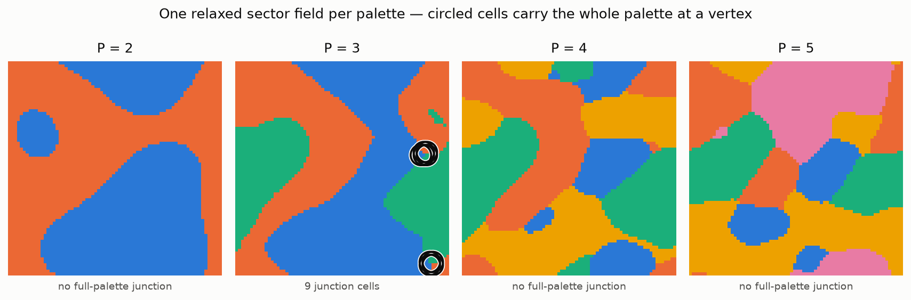

# Project Genesis

**An executable testbench for the Universal Recursion Principle.** The theory
proposes that recursive systems — physical, biological, cognitive — evolve by
climbing a single scalar:

```
S  =  ΔC  +  κ · ΔI
```

**ΔC** is *distinction*: making differences, articulating structure. **ΔI** is
*integration*: binding those differences into something coherent. **κ** is the
finite *capacity* that decides how much integration a system can afford.

The claim that does the work is an asymmetry. Distinction is cheap — noise makes
gradients. Integration is expensive, and the bill comes due exactly where
distinction is richest. So a recursive system can always distinguish more than it
can integrate, never catches up, and *in failing to catch up it builds
structure*.

**This repository does not argue for that.** It builds instruments that measure
it, runs them, and reports verdicts — including when the answer is no.

---

## Start here

| If you want | Read |
|---|---|
| The theory, from zero, in half an hour | [`Docs/The_Principle.md`](Docs/The_Principle.md) |
| One result that stands entirely alone, no framework needed | [`Docs/Junction_Selection.md`](Docs/Junction_Selection.md) |
| The full chronological record, ~100 experiments with verdicts | [`Docs/Experiment_Log.md`](Docs/Experiment_Log.md) |
| To actually run the thing — CLI, agents, server, browser toys | [`Docs/Usage.md`](Docs/Usage.md) |

Every claim in `The_Principle.md` is tagged with its standing: **[measured]** —
a pre-registered experiment with a verdict; **[framework]** — a coherent
consequence that has *not* been tested; **[declined]** — something the programme
explicitly refuses to claim.

---

## What it looks like

<picture>
  <source media="(prefers-color-scheme: dark)" srcset="Docs/img/junctions-dark.png">
  
</picture>

Four relaxed sector fields. A circled cell is one whose immediate neighbourhood
carries **every** sector at once, at a vertex rather than along a wall. Two
sectors cannot form such a junction; four and five form plenty of junctions but
essentially none that bind the whole palette. Three can, and does.

It generalises: in `d` dimensions the palette maximising full-palette junction
density is **`d + 1`**, at `d = 1, 2, 3, 4`.

**And it needs none of this repository's physics.** A plain Voronoi diagram —
random points, nearest-neighbour colouring, no dynamics — returns the same
answer, scored with the same unmodified measure. So does pure noise. The measure
is zero below `d + 1` by construction and decreasing above it, so it peaks there
before any field exists. This was the headline claim until an outside review
supplied the control; it is now
[a retraction](Docs/Junction_Selection.md), and the control is
[`n3_junction_null.py`](experiments/n3_junction_null.py). The picture is real and
the arithmetic is generic.

---

## What has been measured

Load-bearing results only. Negatives included, because they are the point.

| Question | Verdict |
|---|---|
| Does a field select a palette size, and which? | **`d + 1`** — but so does a Voronoi diagram and so does random noise. The measure forces its own argmax; this is **retracted** as a result about the field ([control](experiments/n3_junction_null.py)) |
| Is that selection driven by capacity scarcity? | **No — refuted.** It is geometric: codimension counting, of which Plateau's trivalent vertex is the 2-D case. `P = 3` peaks at every capacity level *including no capacity field at all* |
| Does distinction outrun integration by a fixed amount? | **Yes — and it is a restatement of locality.** `n_C = 1.99`, `n_I = 0.95`, gap `1.04`, stable under every convention swept. But an extensive density scales as `ℓ^d` and boundary-mediated information as `ℓ^(d−1)` for *any* local field, so the gap of 1 has no residue left once both exponents are known |
| Does the capacity law transplant off the lattice? | **The eviction condition does** — to a Hopfield network and a Kuramoto oscillator population, three structurally unrelated substrates. Whether the crossing sits at a substrate-independent `κ` is **not settled** |
| Is the optimum's *route* to criticality a substrate fact? | **No.** It moves when you change how ΔC is read. The *condition* survives; the route was measuring the dictionary |
| Does scarcity evict an ordered optimum? | **Yes, ceiling-free**: exactly when the ordered point starts ahead and holding it costs capacity |
| Have the robustness claims themselves been checked? | **Yes, and `2/3` of the re-scoring predictions failed.** One claim — §2's gap — turned out *unevidenced by all three sweeps cited for it*; the others were genuinely tested and held |

That last row is the honest headline. A claim can pass a robustness bar because
nothing moved rather than because it resisted, and telling those apart needed
[a separate instrument](project_genesis/robustness.py). Applied retrospectively
it refuted two of its own three predictions — the blind spot turned out to be
narrower than feared, and the `P = 3` selection survived a convention that
genuinely threatened it.

## What would refute it

Two entries were withdrawn from this list after an outside review, and the reason
is worth more than the entries were:

- ~~A palette other than `d + 1` scoring higher on a resolved field.~~
  **Not a falsifier.** Nothing about any theory could make it come out
  differently — the measure forbids it.
- ~~An integration measure that scales with volume rather than surface.~~
  **Not a falsifier.** Gradient energy is an extensive density, so it scales as
  `ℓ^d`; mutual information across a boundary scales as `ℓ^(d−1)`. The gap is
  `d − (d−1) = 1` for any local field with a finite correlation length. The
  experiment's own calibration control is a Gaussian random field with no
  dynamics, which produces the area law by construction.
- **A capacity sweep that moves the integrated fraction.** This one stands — it
  was run, it is a real prediction about the dynamics, and it does not move.

A falsifier that no possible world could satisfy is not a falsifier. Finding that
two of three were arithmetic rather than physics is the most useful thing that
happened to this list.

---

## Quickstart

```bash
pip install -r requirements.txt

# the central result, d = 1, 2, 3
python experiments/n3_junction_scale.py
python experiments/n3_junction_scale.py --with-4d   # adds d = 4 (~60 min)

# the scaling dimension of the gap, and its convention audit
python experiments/n3_area_law.py
python experiments/n3_gap_conventions.py

# the capacity law on three substrates
python experiments/n3_criticality_transplant.py
python experiments/n3_kuramoto_transplant.py

python experiments/n3_junction_null.py     # the control that retracted d+1
python experiments/n3_rg_flow.py           # does anything survive coarse-graining?

python -m unittest discover -s tests      # ~1280 checks, ~15 min
python tools/make_figures.py              # regenerate the figures above
```

Every experiment prints its **pre-registered predictions**, its measurement, and
its verdict — including when the prediction failed. None of them is silent about
losing.

## Layout

```text
project_genesis/     the instruments — field dynamics, capacity, gauge sector,
                     substrates (Hopfield, Kuramoto), and the measures
experiments/         one file per question, each self-scoring
tests/               ~1280 checks pinning the central claims so they cannot
                     drift silently
Docs/                the theory, the standalone results, the full record
tools/               figure generation
web/ , viewer/       zero-dependency browser toys sharing the same dynamics
```

Module-by-module detail, and how to run the sandbox, the agents and the browser
toys, is in [`Docs/Usage.md`](Docs/Usage.md).

---

## How the work is done

One loop, repeated: **state a claim → build an instrument → run it → report the
verdict, caveats included.** Four habits keep it honest, all of them learned by
getting something wrong first:

- **Pre-register the prediction and its falsifier**, in the experiment file,
  before running it. Failed predictions stay recorded as failed.
- **Sweep the conventions.** Nearly every confident reading in this repo turned
  out to rest on a constant nobody derived — a threshold, a fitting window, a
  search ceiling. Sweeping them is how you find out which.
- **Quote the headroom, not just the pass.** "It didn't move" is not a result
  until you show the sweep *could* have moved it.
- **Report ranges when the statistics only support ranges.** A number quoted more
  precisely than the thing behind it is the most common error here.

Corrections are kept in place rather than tidied away. A programme that never
records having been wrong gives you no way to check the parts that are right.

## Scope

This is a **map and an instrument**, not evidence about the physical world. The
simulations are small, the lattices are finite, and where a result is a
lattice-units signature rather than a physical measurement it says so. Several
of the theory's most interesting claims are marked `[framework]` — coherent
consequences that have not been tested here, and are not asserted.

The foundational theory document is
`Docs/The Universal Recursion Principle (URP) _260312_170343.txt`.
